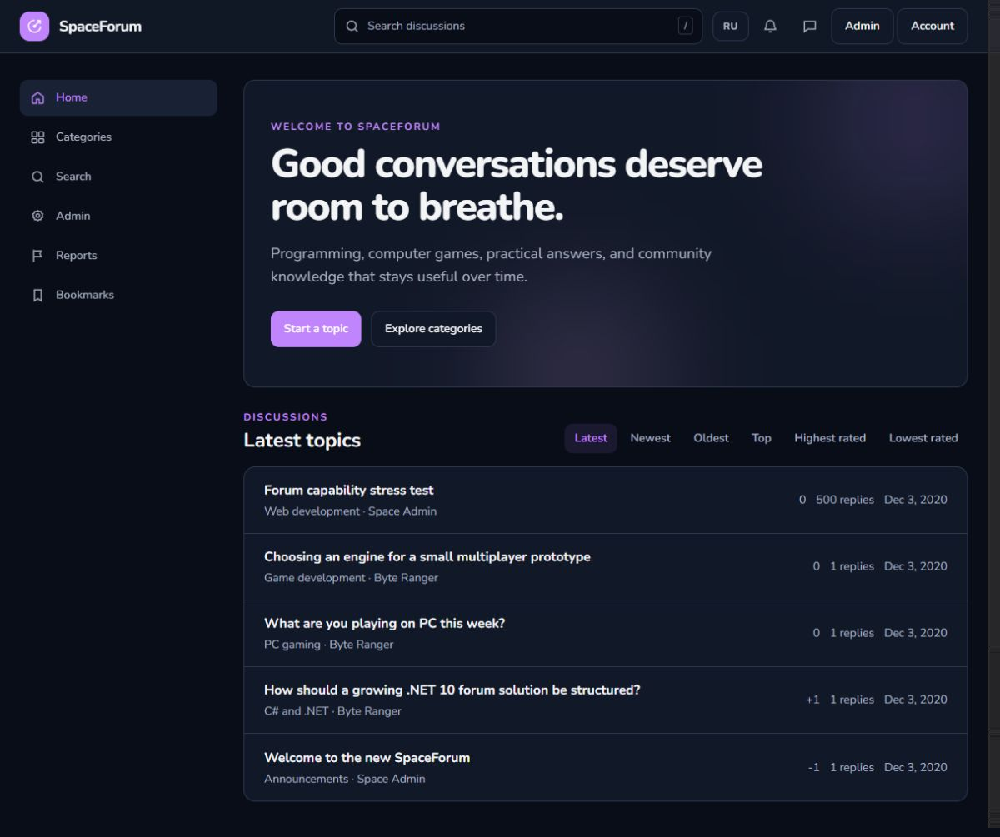
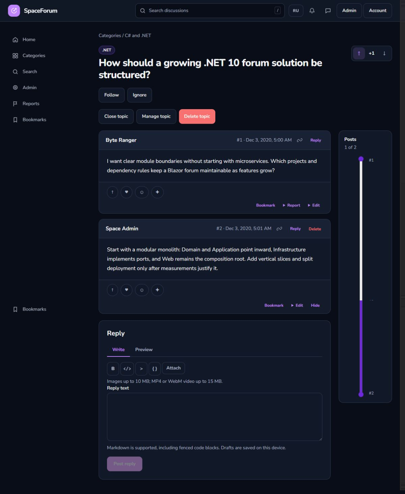
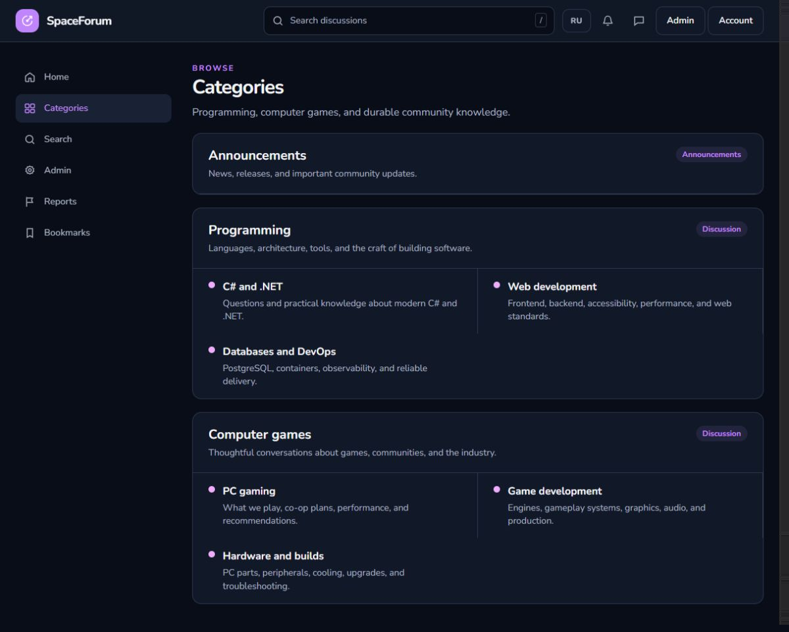

# SpaceForum

SpaceForum is a responsive, server-rendered community forum for long-form discussions, practical answers, and thoughtful moderation. It combines a fast Blazor interface with PostgreSQL, SQL-first persistence, S3-compatible media storage, and a complete Docker development environment.



## Features

- SEO-friendly server rendering, lower-case routes, topic slugs, post permalinks, and 50-post pagination.
- Categories, nested sections, tags, sortable topic feeds, PostgreSQL full-text search, and instant search suggestions.
- Markdown topics and replies with previews, drafts, code blocks, reply references, local-time rendering, and a stable post navigator.
- Topic voting, post reactions, bookmarks, following and ignoring, notifications, live activity checks, and private messages.
- Image uploads up to 10 MB and MP4/WebM uploads up to 15 MB through private S3-compatible storage with server-side content validation.
- Registration, email confirmation, password recovery, profile editing, passkeys, authenticator-based 2FA, recovery codes, and English/Russian localization.
- Member, moderator, and administrator roles with permission management, reports, post visibility controls, topic closing, content deletion, user suspension, and an audit log.
- Development seed data with programming and PC-gaming categories, realistic discussions, and a 500-reply pagination scenario.





## Technology stack

- .NET 10 and Blazor Web App with interactive server rendering
- PostgreSQL 18.4 with parameterized Npgsql SQL; EF Core is limited to ASP.NET Core Identity
- Tailwind CSS 4, Nunito Variable, and a responsive token-based design system
- S3-compatible object storage, Mailpit development email, and Docker Compose
- Markdig, xUnit v3, and centralized NuGet package management

The solution is defined in `SpaceForum.slnx`. Source is split into Domain, Application, Infrastructure, and Web projects, with dependency rules verified by architecture tests.

## Run with Docker

Docker Desktop or another Docker Compose-compatible runtime is the only prerequisite.

```sh
docker compose up --build
```

Open the forum at [http://localhost:8080](http://localhost:8080). Development email is available at [http://localhost:8025](http://localhost:8025), and the object-storage console at [http://localhost:9001](http://localhost:9001).

The first startup builds the application, waits for PostgreSQL, applies the single checksum-verified SQL migration, creates the media bucket, and loads the development seed. Later starts reuse the named volumes.

Development-only accounts:

| Role | Login | Password |
| --- | --- | --- |
| Administrator | `admin` | `SpaceForum!2020` |
| Member | `member` | `ByteRanger!2020` |

Stop the stack while preserving data:

```sh
docker compose down
```

Remove the local development data as well:

```sh
docker compose down --volumes
```

## Local development

```sh
npm install
npm run assets:build
dotnet restore SpaceForum.slnx
dotnet build SpaceForum.slnx --no-restore
dotnet test SpaceForum.slnx --no-build
```

The readable CSS and JavaScript sources live under `src/SpaceForum.Web/Styles` and `src/SpaceForum.Web/Scripts`; production assets are minified during the frontend build. Planned follow-up work is listed in [docs/PLANNED.md](docs/PLANNED.md).
